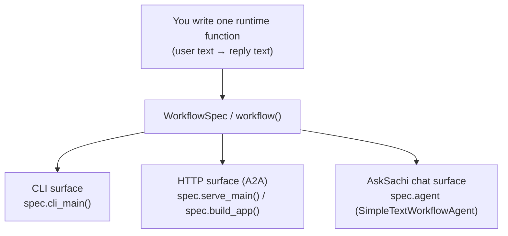
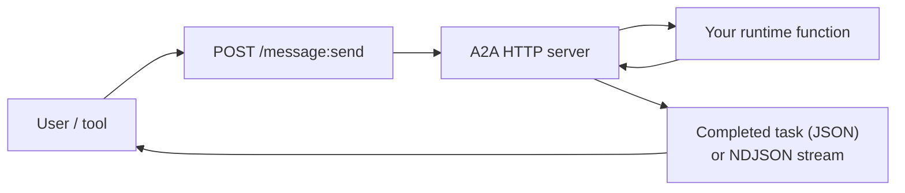
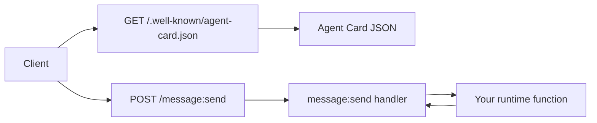
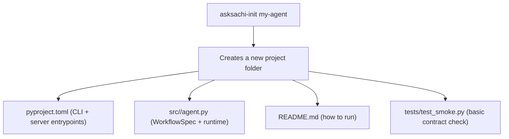

# asksachi-sdk

A small Python toolkit for building **AskSachi-compatible agents**.

You write the agent logic (a function that turns user text into a reply). This SDK helps you run that same agent as:
- a local **CLI** command
- a small **HTTP server** (so other tools can call it)
- an **AskSachi** chat agent

## Why this SDK exists

AskSachi-compatible agents need to follow a few standard formats so other tools can:
- discover the agent
- send it messages
- (optionally) stream the reply as it is generated

This SDK provides those formats and the helper code, so agent projects stay small and you only focus on the agent’s behavior.

## API interface decisions (and why)

- **A2A HTTP+JSON (minimal)**: this is the simplest “agent over HTTP” contract. Tools can discover an agent via an
  Agent Card and call it with `message:send` without knowing anything about your internal code.
- **OpenAI-shaped chat responses**: AskSachi chat uses familiar request/response shapes (`complete_chat` plus streaming),
  which makes it easy to plug agents into chat UIs and existing tooling.
- **NDJSON streaming**: newline-delimited JSON is easy to stream over plain HTTP and easy for clients to parse while
  still emitting a final “completed task” object at the end.

## How it works (flows)





## What it solves

Without `asksachi-sdk`, each agent repo would have to re-implement (and keep consistent):
- A2A Agent Card generation (`/.well-known/agent-card.json`)
- the `message:send` endpoint request/response shape
- streaming behavior used by clients (`Accept: application/x-ndjson`)
- a simple AskSachi chat-agent adapter (OpenAI-shaped responses + streaming)
- CLI helpers for local development

## Contract (what other tools expect)



The minimal HTTP surface implemented by this SDK is:
- `GET /.well-known/agent-card.json`
- `POST /message:send` returning a **completed task** with a **text** artifact

For streaming, clients can send `Accept: application/x-ndjson` to receive:
- one or more `{ "type": "delta", "text": "..." }` lines
- one final `{ "type": "complete", "task": { ... } }` line

## Environment variables

- `ASKSACHI_BASE_URL` (default `http://127.0.0.1:8765`): AskSachi base URL (used for registration)
- `ASKSACHI_API_KEY` (optional): bearer token used for registration
- `ASKSACHI_WORKFLOW_BASE_URL` (optional): the public base URL of this agent service (advertised on registration)

## When to use it

Use `asksachi-sdk` when you want an agent to be runnable as an AskSachi-compatible agent over HTTP, chat, and/or CLI.

## What's inside

| Module | Purpose |
|--------|---------|
| `asksachi_sdk.a2a` | Agent Card, `message:send`, task/artifact shapes, NDJSON streaming |
| `asksachi_sdk.workflow_kit` | `WorkflowSpec` / `@workflow` decorator, `SimpleTextWorkflowAgent`, CLI + uvicorn helpers |
| `asksachi_sdk.models_openai` | Shared OpenAI-compatible request/response models |
| `asksachi_sdk.agents.registry` | In-process agent registry |
| `asksachi_sdk.samples.echo_agent` | Reference implementation — all three surfaces from one `WorkflowSpec` |

## Requirements

- Python 3.12+
- [uv](https://docs.astral.sh/uv/) (recommended) or pip

## Install

```bash
# As a dependency in another project
pip install asksachi-sdk

# For development / running tests
git clone https://github.com/skarkala-akm/asksachi-sdk
cd asksachi-sdk
uv sync --extra dev
```

## Generate a new agent skeleton



```bash
asksachi-init my-agent --id my-agent --title "My Agent" --port 8766
cd my-agent
uv sync
uv run my-agent-cli -m "hello"
uv run my-agent-serve
```

## Run the sample echo agent

The bundled echo agent shows all three surfaces from a single `WorkflowSpec`.

**CLI**:

```bash
uv run echo-agent -m "hello"
```

**A2A HTTP server** (port 8766):

```bash
uv run echo-agent-serve
```

**Smoke-test the A2A server** (once it's running):

```bash
curl http://127.0.0.1:8766/.well-known/agent-card.json
curl -X POST http://127.0.0.1:8766/message:send \
     -H "Content-Type: application/json" \
     -d '{"message": {"parts": [{"text": "hello"}]}}'
```

## Tests

```bash
uv run pytest
```

## Build your own workflow agent

```python
from asksachi_sdk.workflow_kit import workflow

spec = workflow(
    id="my-workflow",
    title="My Workflow",
    description="Does something useful.",
    version="0.1.0",
    port=8767,
)

@spec.runtime
def run(user_text: str) -> str:
    return f"You said: {user_text}"

# A2A HTTP server
app = spec.build_app()   # FastAPI app — use with TestClient or mount elsewhere
spec.serve_main()        # blocking uvicorn (call from __main__)

# CLI
spec.cli_main()          # parses -m / --message from sys.argv
```

See [`src/asksachi_sdk/samples/echo_agent/`](src/asksachi_sdk/samples/echo_agent/) for a complete working example.
