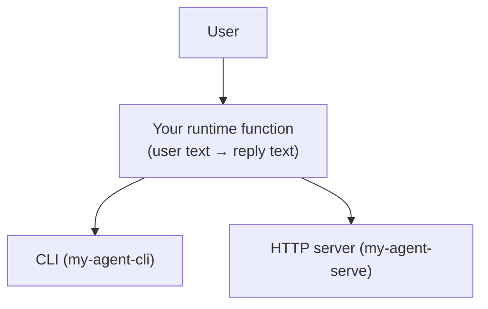

# My Agent

A simple AskSachi-compatible agent.

## How it works (flow)



## Run (CLI)

```bash
uv run my-agent-cli -m "hello"
```

## Install notes

This project depends on `asksachi-sdk`. On a fresh machine, `uv sync` will fetch it from Git.

## Run (HTTP server)

```bash
uv run my-agent-serve
```

## Smoke test (once the server is running)

```bash
curl http://127.0.0.1:8766/.well-known/agent-card.json
curl -X POST http://127.0.0.1:8766/message:send \
     -H "Content-Type: application/json" \
     -d '{"message": {"parts": [{"text": "hello"}]}}'
```
